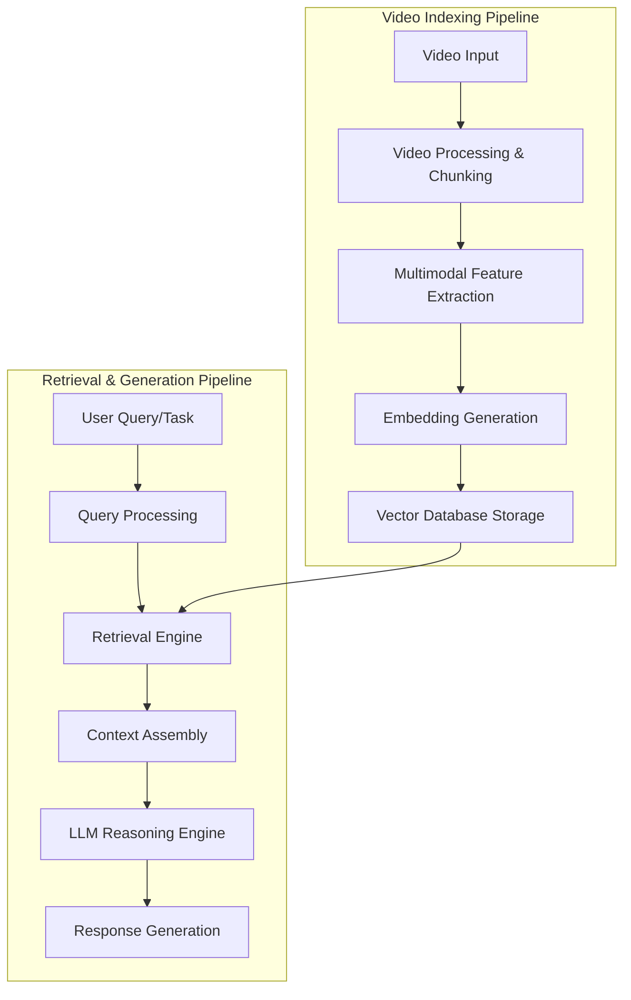

# AI-Driven Video Understanding System: A Video RAG Approach

## Table of Contents

- [1. Introduction](#1-introduction)
- [2. High-Level System Design](#2-high-level-system-design)
  - [2.1 Architecture Overview](#21-architecture-overview)
  - [2.2 Technology Choices](#22-technology-choices)
  - [2.3 RAG-Specific Processing Pipeline](#23-rag-specific-processing-pipeline)
- [3. Addressing Specific Technical Challenges](#3-addressing-specific-technical-challenges)
  - [3.1 Accurate Time-Stamping](#31-accurate-time-stamping)
  - [3.2 Multi-Genre/Content Type Support](#32-multi-genrecontent-type-support)
  - [3.3 Variable Video Length Handling](#33-variable-video-length-handling)
  - [3.4 Contextual Summarization](#34-contextual-summarization)
  - [3.5 Multi-Modal Search Capabilities](#35-multi-modal-search-capabilities)
  - [3.6 Scalability, Performance & Cost Considerations](#36-scalability-performance--cost-considerations)
  - [3.7 Scene Graph-Based Visual Reasoning](#37-scene-graph-based-visual-reasoning)
- [4. Limitations & Creative Workarounds](#4-limitations--creative-workarounds)
  - [4.1 Current Limitations in Video Understanding](#41-current-limitations-in-video-understanding)
  - [4.2 Creative Workarounds](#42-creative-workarounds)
  - [4.3 Dynamic Retrieval: Key Advantage Over Direct Models](#43-dynamic-retrieval-key-advantage-over-direct-models)
- [5. Evaluation Framework](#5-evaluation-framework)
  - [5.1 Key Metrics](#51-key-metrics)
  - [5.2 Testing Methodology](#52-testing-methodology)
  - [5.3 Quality Assurance](#53-quality-assurance)
- [6. AI Tool Usage Throughout Development](#6-ai-tool-usage-throughout-development)
- [7. Conclusion](#7-conclusion)
- [8. References](#8-references)

## 1. Introduction

This document presents a design for a video understanding system using a Video RAG (Retrieval Augmented Generation) architecture. This approach addresses the challenges of analyzing video content by chunking videos into retrievable segments, creating multimodal embeddings, and using a retrieval system to provide relevant context to generative AI models for understanding and analysis tasks.

For more information about the research and decision-making process behind this system design, please see the [approach document](approach.md).

## 2. High-Level System Design

### 2.1 Architecture Overview

The proposed Video RAG system follows a retrieval-first architecture that emphasizes efficient indexing and retrieval of video segments:



### 2.1.1 Implementation Notes: Conceptual Architecture vs. Code

While the architecture diagram provides a conceptual overview, our Video-RAG implementation employs several pragmatic optimizations:

1. **Query-First Approach**: Rather than processing all modalities, our implementation (in `vidrag_pipeline.py`) first analyzes the query to determine which information types are needed:

   ```python
   # First analyze what information the query needs
   json_request = llava_inference(retrieve_pmt_0, None)
   # Then selectively process only required modalities
   if request_det is not None: # Only extract visual features if needed
   ```

2. **On-Demand Processing**: Instead of pre-computing all features, we dynamically select frames for processing based on relevance to the query:

   ```python
   # Use CLIP to identify which frames are most relevant to the query
   similarities = (clip_img_feats @ text_features.T).squeeze(0).mean(1).cpu()
   det_top_idx = [idx for idx in range(max_frames_num) if similarities[idx] > clip_threshold]
   ```

3. **In-Memory Vector Search**: Rather than a persistent vector database, we use on-the-fly similarity search with FAISS:

   ```python
   # Dynamic threshold-based retrieval using normalized vectors
   index = faiss.IndexFlatIP(dimension)
   index.add(document_vectors)
   lims, D, I = index.range_search(query_vector, threshold)
   ```

This implementation approach maintains the conceptual benefits while optimizing for efficiency and real-world performance. The key differences from the conceptual architecture include:

- **Selective Processing Pipeline**: Process only what's needed based on query analysis
- **Dynamic Feature Extraction**: Extract features from relevant frames only
- **Memory-Based Vector Search**: Use in-memory FAISS rather than a persistent database
- **Query-Driven Workflow**: Let the query guide which processing steps to execute

These optimizations significantly improve efficiency while maintaining the core RAG principles of retrieval-based context enhancement.

#### Core Components

1. **Video Processing & Chunking**
   - Video segmentation strategies:
     - Fixed-length chunking (time-based segments)
     - [Dynamic scene chunking based on scene boundaries](https://blog.mixpeek.com/dynamic-video-chunking-scene-detection/)
     - Overlapping chunks for context preservation
     - Hierarchical chunking (shots → scenes → sequences)

2. **Multimodal Feature Extraction**
   - Visual features:
     - Frame sampling and key frame extraction
     - Object and scene detection via pre-trained models
     - Face detection and clustering
     - Visual aesthetic features (composition, lighting)
     - **Scene graph generation for spatial relationship understanding**
   - Audio features:
     - Speech recognition with timestamps (Whisper model)
     - Speaker diarization
     - Non-speech audio event detection
     - Audio characteristics (volume, tempo, mood)
   - Text features:
     - Transcript processing
     - Caption and on-screen text extraction
     - Named entity recognition
     - Dialogue structure analysis

3. **Embedding Generation**
   - Multimodal fusion strategies:
     - Early fusion: combined features before embedding
     - Late fusion: separate embeddings with weighted combination
     - Hierarchical fusion: structured representation of relationships
   - Embedding models:
     - CLIP for visual-semantic alignment
     - Sentence-transformers for textual embeddings
     - Custom-trained multimodal embedders for domain-specific needs
   - Timestamp preservation:
     - Temporal metadata associated with each embedding
     - Time range annotations for chunk boundaries
     - Segment relationships (before/after/contains)

4. **Vector Database Storage**
   - Storage architecture:
     - Scalable vector database for similarity search (Pinecone or Weaviate)
     - Time-indexed metadata store
     - Hybrid search capabilities (vector + structured filters)
   - Indexing optimizations:
     - Approximate nearest neighbor algorithms (HNSW)
     - Multi-index approach for different modalities
     - Quantization for storage efficiency
   - Retrieval functionality:
     - k-nearest neighbor search
     - Hybrid filtering (time ranges, content types)
     - Diversity sampling for broader context

5. **Query Processing**
   - Query understanding:
     - Natural language query parsing
     - Query type classification
     - Intent extraction
     - Time-range and constraint identification
   - Query optimization:
     - Decomposition of complex queries. Splitting original query into sub-queries.
     - Query rewriting for retrieval effectiveness / query expansion / prompt compression.

6. **Retrieval Engine**
   - Search strategies:
     - Dense retrieval using vector similarity
     - Multi-step retrieval for complex queries
     - Re-ranking based on relevance scoring (potentially leveraging BM25 algo for text)
   - Context window management:
     - Dynamic retrieval count based on query complexity and document size
     - Adaptive chunk selection based on information density
     - Context window optimization for LLM capacity

7. **Context Assembly**
   - Contextual ordering:
     - Chronological sequencing of retrieved segments
     - Importance-based prioritization
     - Causal relationship structuring
   - Information fusion:
     - Redundancy removal across chunks
     - Contradiction identification
     - Confidence-weighted integration

8. **LLM Reasoning Engine**
   - Prompt engineering:
     - Task-specific prompt templates
     - Few-shot examples for complex tasks
     - System messages for role definition
   - Context handling:
     - Chunking and prioritization of retrieved content
     - Context compression techniques
     - Information highlighting for attention focusing
   - Reasoning strategies:
     - Chain-of-thought reasoning for complex analysis
     - Multiple perspective analysis
     - Uncertainty representation

9. **Response Generation**
   - Output formatting:
     - Structured data for programmatic consumption
     - Natural language for human consumption
     - Multimodal responses (text + key frames)
   - Explanation and evidence:
     - Citation of source segments
     - Confidence scoring for generated insights
     - Alternative interpretations when ambiguous
   - Quality control:
     - Factual consistency checking
     - Logical coherence validation
     - Response filtering for inappropriate content

### 2.2 Technology Choices

| Component | Technology Used | Rationale |
|-----------|----------------|-----------|
| Video Processing | Decord + FFmpeg | Decord provides efficient frame extraction with precise timestamps; FFmpeg handles audio extraction and format conversion |
| Visual Feature Extraction | CLIP (clip-vit-large-patch14-336) + APE (All-Purpose Entity Detector) | CLIP provides zero-shot visual understanding with strong embedding capabilities; APE delivers open-vocabulary object detection with bounding boxes |
| Audio Processing | Whisper + Torchaudio | State-of-the-art speech recognition with multilingual capabilities; Torchaudio enables efficient audio chunking and processing |
| Text Processing | Contriever | Efficient and effective text embedding generation with strong semantic understanding for retrieval |
| OCR | EasyOCR | Open-source OCR system that extracts text from video frames with confidence scoring |
| Object Detection | APE (via Detectron2) | Zero-shot detection of objects mentioned in queries; provides both object localization and relationship information |
| **Scene Graph Generation** | **Custom NetworkX-based pipeline** | **Converts object detections into spatial relationship graphs for enhanced visual reasoning** |
| Vector Search | FAISS | Facebook AI Similarity Search provides highly optimized vector search with range-based thresholding |
| RAG Orchestration | Custom dynamic threshold retrieval | Threshold-based retrieval that adapts to content and query complexity rather than fixed top-k |
| LLM Integration | LLaVA-Video-7B-Qwen2 | Open-source video-language model with strong reasoning capabilities |
| Service Architecture | Socket-based microservices | Decoupled inference services (e.g., APE) communicate via socket connections for scalability |
| Multimodal Reasoning | Query-guided selective processing | Dynamic selection of which modalities to process based on query requirements |
| Retrieval Strategy | Visually-aligned selective processing | Uses CLIP for targeted frame selection to process only the most relevant frames |

The implementation specifically favors open-source components throughout the pipeline:

1. **Core Video Understanding**: LLaVA-Video (open-source alternative to proprietary video models)
2. **Text Embeddings**: Contriever (open-source alternative to proprietary embedding models)
3. **Speech Recognition**: Whisper (open-source ASR with competitive performance)
4. **Object Detection**: APE with Detectron2 (open-source detection framework)
5. **Vector Search**: FAISS (industry-standard open-source similarity search)
6. **OCR**: EasyOCR (open-source text extraction)

This open-source foundation ensures the system remains vendor-independent while still achieving state-of-the-art performance through targeted retrieval and careful integration.

### 2.3 RAG-Specific Processing Pipeline

1. **Ingestion & Chunking Phase**
   - Video upload and initial validation
   - Content type classification to determine optimal chunking strategy
   - Adaptive chunking based on content complexity:
     - Dense content (action sequences): shorter chunks (30-60s)
     - Dialogue-heavy content: speaker turn-based chunking
     - Documentary/educational: topic-based chunking
   - Chunk metadata extraction:
     - Time range (start/end timecodes)
     - Shot count
     - Scene complexity metrics
     - Speaker presence

2. **Feature Extraction Phase**
   - Parallel processing of chunks:
     - Visual: keyframe extraction, object detection, scene classification
     - Audio: speech-to-text, speaker identification, audio event detection
     - Text: OCR for on-screen text, metadata parsing
     - **Spatial relationship analysis:**
       - **Graph-based scene representation using NetworkX**
       - **Natural language description of object relationships and positions**
       - **Object counting and type grouping**
   - Feature aggregation at chunk level:
     - Entity presence summary (characters, objects, locations)
     - Action summary
     - Dialogue summary
     - Emotional tone assessment
     - **Spatial layout understanding through scene graphs**

3. **Embedding Generation Phase**
   - Modality-specific embeddings:
     - Visual embeddings from key frames
     - Audio embeddings from sound profile
     - Text embeddings from transcripts and detected text
   - Multimodal fusion approaches:
     - Concatenation with learned projection
     - Cross-attention between modalities
     - Joint embedding space training
   - Chunk-level master embeddings:
     - Combined representation optimized for retrieval
     - Temporal relationship preservation
     - Hierarchical structure (sub-chunks to chunks to sequences)

4. **Indexing Phase**
   - Vector database insertion with metadata:
     - Embeddings with chunk identifiers
     - Rich metadata for filtering (time ranges, speakers, entities)
     - Cross-reference information between related chunks
   - Index optimization:
     - Sharding strategy for large video collections
     - Caching frequently accessed chunks
     - Indexing hierarchy for multi-level retrieval

5. **Query Processing Phase**
   - Query analysis and enhancement:
     - Intent classification (search, summarize, analyze)
     - Entity and constraint extraction
     - Query expansion with related concepts
   - Modality-specific query formulation:
     - Text query to multimodal embedding conversion
     - Visual query processing (image-based search)
     - Hybrid query support

6. **Retrieval Phase**
   - Multi-stage retrieval:
     - Initial broad retrieval based on semantic similarity
     - Re-ranking based on relevance to specific query aspects
     - Diversity sampling to ensure coverage
   - Context optimization:
     - Dynamic token budget management
     - Information density evaluation
     - Redundancy elimination
     - Chronological or logical ordering

7. **Reasoning & Response Phase**
   - Context-enriched prompting:
     - Task specification with retrieved video contexts
     - Structured prompting with context pointers
     - Few-shot examples for complex tasks
   - LLM-based analysis over retrieved contexts:
     - Structured reasoning about video content
     - Gap-filling for missing information
     - Confidence assessment and uncertainty signaling
   - Response formatting based on query intent:
     - Direct answers with evidence
     - Generated summaries with key points
     - Analytical insights with supporting segments

## 3. Addressing Specific Technical Challenges

### 3.1 Accurate Time-Stamping

The Video RAG approach addresses time-stamping challenges through:

- **Chunk-Level Temporal Boundaries**:
  - Each chunk has precise start/end timestamps
  - All features and embeddings inherit their source chunk's temporal context
  - Hierarchical time references (frame → shot → scene → chunk)

- **Temporal Metadata Preservation**:
  - Temporal metadata stored alongside embeddings
  - Enables time-based filtering during retrieval
  - Allows for chronological reassembly of retrieved chunks

- **Time-Aware Retrieval**:
  - Queries can include temporal constraints
  - Time-proximity boosting for sequential understanding
  - Temporal context windows that expand beyond single chunks when needed

- **Implementation approach**:
  - Each embedding vector tagged with:
    - Absolute time range (HH:MM:SS.ms to HH:MM:SS.ms)
    - Relative position (% through total content)
    - Neighboring chunk IDs for context expansion
  - Time-based vector database filtering
  - Custom time-based relevance scoring

### 3.2 Multi-Genre/Content Type Support

The Video RAG system adapts to different content types through:

- **Content-Adaptive Processing**:
  - Content classifiers determine optimal chunking strategies
  - Genre-specific feature extractors prioritize relevant attributes
  - Custom embedding generation tuned to content characteristics

- **Genre-Specific Retrieval Strategies**:
  - Action content: prioritizing visual features and movement
  - Dialogue content: emphasizing transcript and speaker features
  - Educational content: focusing on information density and structure

- **Dynamic Context Window Sizing**:
  - Ads: smaller chunks (5-30 seconds)
  - TV episodes: medium chunks (1-3 minutes)
  - Movies: hierarchical chunks with relationships

### 3.3 Variable Video Length Handling

The RAG architecture naturally addresses variable length content through:

- **Length-Independent Chunking**:
  - Content broken into manageable chunks regardless of total length
  - Similar processing approach for 30-second ads or 2-hour movies
  - Hierarchical chunking for longer content

- **Efficient Retrieval at Scale**:
  - Vector search complexity based on query relevance, not content length
  - Metadata filtering to narrow search space before vector similarity
  - Progressive loading of context for extremely long content

- **Context Preservation Across Chunks**:
  - Overlapping chunk boundaries (10-30% overlap)
  - Cross-references between related chunks
  - Global context embeddings for entire content pieces

### 3.4 Contextual Summarization

The Video RAG implementation uses a retrieval-augmented approach to contextual summarization rather than traditional summarization techniques:

- **Query-Guided Contextual Retrieval**:
  - Analyzes queries to determine required information types using structured JSON request parsing:

    ```python
    json_request = llava_inference(retrieve_pmt_0, None)
    try:
        request_det = json.loads(json_request)["DET"]
        request_asr = json.loads(json_request)["ASR"]
    except:
        request_det = None
        request_asr = None
    ```

  - Selectively retrieves only content relevant to the specific query
  - Uses threshold-based dynamic retrieval rather than fixed top-k:

    ```python
    def retrieve_documents_with_dynamic(documents, queries, threshold=0.4):
        # ...
        index = faiss.IndexFlatIP(dimension)
        index.add(document_vectors)
        lims, D, I = index.range_search(query_vector, threshold)
    ```

- **Multi-Modal Context Assembly**:
  - Assembles context from different modalities based on query needs:
    - Speech transcripts from ASR when relevant
    - Text from OCR when on-screen information matters
    - Visual object descriptions from relevant frames
  - Builds a comprehensive context document with temporal markers:

    ```python
    if len(det_docs) > 0:
        for i, info in enumerate(det_docs):
            if len(info) > 0:
                qs += f"Frame {str(det_top_idx[i]+1)}: " + info + "\n"
    ```

- **LLM-Based Reasoning Over Retrieved Context**:
  - Forwards the assembled multi-modal context to the LLM
  - LLM performs reasoning and generates response based on retrieved evidence
  - Maintains connection between response and source content
  
This approach differs from traditional summarization by focusing on query-relevant content rather than general video summaries. It preserves temporal context while filtering irrelevant information, delivering more precise and contextually aware responses.

### 3.5 Multi-Modal Search Capabilities

Video RAG enables powerful search capabilities:

- **Multimodal Query Understanding**:
  - Text queries converted to appropriate embedding space
  - Visual queries (search by image) supported
  - Hybrid query modes combining constraints

- **Semantic Search Implementation**:
  - Dense vector retrieval for concept matching
  - Fuzzy matching for inexact queries
  - Cross-modal inference (finding visual elements from text descriptions)
  - **Spatial relationship querying:**
    - **Search for specific object arrangements (e.g., "person to the left of car")**
    - **Scene composition understanding through graph-based representations**
    - **Positional reasoning for complex visual questions**

- **Search Result Explanation**:
  - Evidence highlighting from retrieved chunks
  - Confidence scoring for search results
  - Alternative interpretations for ambiguous queries
  - **Visual relationship explanations using scene graph descriptions**

### 3.6 Scalability, Performance & Cost Considerations

The RAG architecture provides several efficiency advantages:

- **Preprocessing Efficiency**:
  - One-time processing and embedding generation per video. Videos can be split up into multiple segments if required before processing
  - Incremental updates for modified content can be done without reprocessing entire videos in the background
  - Batch processing of video segments for parallelization for one video multiple chunks

- **Retrieval Efficiency**:
  - Sub-linear search complexity using approximate nearest neighbor algorithms (top-k search)
  - Metadata filtering before vector search to reduce candidates
  - Caching of frequent queries and popular chunks

- **Compute Optimization**:
  - Heavy processing during ingestion, lightweight during query
  - GPU utilization primarily for batch embedding generation
  - CPU-optimized inference for retrieval phase

- **Storage Optimization**:
  - Vector quantization for compact embedding storage
  - Tiered storage strategy (hot/warm/cold paths)
  - Smart caching of frequently accessed chunks

### 3.7 Scene Graph-Based Visual Reasoning

The system incorporates scene graph generation to enhance spatial reasoning about visual content:

#### 3.7.1 Scene Graph Generation

Scene graphs convert flat object detections into structured spatial relationship representations:

- **Graph Construction**: Using NetworkX, objects detected in frames become nodes in a directed graph
- **Spatial Relationship Calculation**: For each pair of objects, the system calculates geometric relationships:

  ```python
  def calculate_spatial_relations(bbox1, bbox2):
      # Calculate relationships based on bounding box coordinates
      relations = []
      if xmin1 < xmax2 and xmax1 > xmin2 and ymin1 < ymax2 and ymax1 > ymin2:
          relations.append("overlaps")
      if xmax1 < xmin2:
          relations.append("left_of")
      # Additional relations: right_of, above, below
  ```

- **Object Counting**: The system tracks occurrences of each object type for quantitative analysis
- **Natural Language Description**: Converts spatial relationships into human-readable descriptions:

  ```python
  # Example scene graph description output:
  # "Object 1 (person) is to the left of Object 2 (car)."
  # "Object 3 (dog) is below Object 4 (bench)."
  ```

#### 3.7.2 Retrieval Integration

During the retrieval process, scene graphs enhance understanding in several ways:

1. **Spatial Query Support**: Enables queries about object relationships (e.g., "Is there a person next to a car?")
2. **Relational Context**: Provides structural information beyond mere object presence
3. **Enhanced Visual Descriptions**: Enriches context with spatial arrangement information:

   ```
   Frame 24: A person (Object 1) is standing to the left of a car (Object 2).
   There are 3 people and 2 cars in the scene.
   ```

#### 3.7.3 Implementation Benefits

The scene graph approach offers several advantages during retrieval:

- **Compositional Understanding**: Breaks complex scenes into interpretable relationships
- **Implicit Query Expansion**: When searching for "person beside car," also matches relevant spatial arrangements
- **Improved Multi-object Reasoning**: Helps answer questions requiring understanding of how objects relate to each other
- **Quantitative Analysis**: Supports counting and composition questions through object grouping

This scene graph functionality significantly improves the system's ability to reason about spatial relationships in video content, enabling more sophisticated visual understanding beyond simple object detection.

## 4. Limitations & Creative Workarounds

### 4.1 Current Limitations in Video Understanding

Current video understanding technologies face several key limitations:

1. **Multimodal Model Constraints**:
   - Video length restrictions (typically <1 hour for models like Gemini)
   - Limited frame sampling rates (e.g., 1 FPS) missing rapid motion
   - Difficulties with non-speech audio recognition and interpretation
   - Content moderation restrictions that may reject legitimate content

2. **Semantic Understanding Challenges**:
   - Gap between visual concepts and abstract ideas
   - Incomplete alignment between visual and audio modalities
   - Limited understanding of cultural references and visual metaphors
   - Difficulty with implicit content and symbolism

3. **Technical Implementation Barriers**:
   - LLM token limits restricting context utilization
   - Embedding quality trade-offs between dimension and performance
   - Processing inefficiencies with longer content
   - Cross-modal reference resolution complexity

### 4.2 Creative Workarounds

Our Video RAG implementation addresses these limitations through several innovations:

1. **Hierarchical Retrieval Strategy**
   - Coarse-to-fine retrieval approach with dynamic depth adjustment
   - Multi-stage filtering to narrow search space efficiently
   - Cross-referencing between related video segments

2. **Context Optimization**
   - Compression of retrieved chunks before LLM processing
   - Essential information extraction while reducing token count
   - Specialized models for pre-summarization of context

3. **Multi-Query Expansion**
   - Generation of perspective-based query variants
   - Diverse context retrieval addressing different content aspects
   - Aggregation of insights across multiple retrieval passes

4. **Adaptive Processing Pipeline**
   - Variable frame sampling based on motion detection
   - Dedicated audio event detection complementing speech recognition
   - Post-processing of transcripts for improved formatting and speaker attribution
   - Tiered safety classification with alternative processing paths
   - **Scene graph generation for enhanced spatial understanding:**
     - **Converts flat object detections into relational graphs**
     - **Enables reasoning about object interactions and positioning**
     - **Generates natural language descriptions of spatial relationships**
     - **Supports queries about object relationships and scene composition**

### 4.3 Dynamic Retrieval: Key Advantage Over Direct Models

Our threshold-based dynamic retrieval mechanism offers significant advantages:

1. **Precise Relevance Control**:
   - Returns only truly relevant segments based on semantic similarity
   - Adapts automatically to query complexity and content density
   - Avoids forcing irrelevant results when no good matches exist

2. **Temporal Precision**:
   - Maintains exact timecode information for every retrieved segment
   - Enables reasoning across distant parts of long videos
   - Scales to any content duration without performance degradation

3. **Semantic Accuracy**:
   - Multi-query integration captures complex information needs
   - Normalized vectors ensure fair comparison across content types
   - Builds connections between related concepts across time
   - Maintains global context while retrieving local segments

4. **Resource Efficiency**:
   - Processes only relevant segments rather than entire videos
   - Scales economically with content volume through sub-linear search complexity
   - Dramatically reduces token usage for LLM reasoning

## 5. Evaluation Framework

Our evaluation framework assesses the system against standardized video understanding benchmarks, focusing on multiple-choice question answering across diverse video types:

### 5.1 Benchmark Datasets

We evaluate our Video-RAG system using three key benchmark datasets:

#### 5.1.1 Video-MME

A comprehensive video understanding benchmark with multiple-choice questions covering various video understanding tasks:

```python
# From evals/generate_videomme.py
with open("videomme_json_file.json", 'r', encoding='utf-8') as file:
    mme_data = json.load(file)
```

#### 5.1.2 Long Video Benchmark (LVB)

A specialized dataset focusing on longer video content to test temporal reasoning over extended durations:

```python
# From evals/generate_longvideobench.py
# val set
mme_data = LongVideoBenchDataset(data_path, "lvb_val.json", max_num_frames=max_frames_num).data
```

#### 5.1.3 Multi-task Learning for Video Understanding (MLVU)

A diverse dataset categorized by question types to evaluate different aspects of video understanding:

```python
# From evals/generate_mlvu.py - MLVU question types
question_types = ["plotQA", "findNeedle", "ego", "count", "order", "anomaly_reco", "topic_reasoning"]
```

### 5.2 Evaluation Methodology

Our evaluation focuses on the model's ability to correctly answer multiple-choice questions about video content, with comprehensive processing including:

#### 5.2.1 Multi-modal Feature Extraction

We dynamically extract relevant features based on query requirements using a selective processing approach:

```python
# Query-guided feature extraction from evals/generate_videomme.py
json_request = llava_inference(retrieve_pmt_0, None)
# Selective processing based on query needs
try:
    request_det = json.loads(json_request)["DET"]
    request_asr = json.loads(json_request)["ASR"]
    # Process only what's needed
except:
    request_det = None
    request_asr = None
```

#### 5.2.2 Modality-Specific Evaluation

We evaluate performance across three key modalities:

1. **Visual Object Detection**:
   - Use CLIP for visual similarity scoring
   - APE (All-Purpose Entity Detector) for object detection
   - Threshold-based frame selection: `det_top_idx = [idx for idx in range(max_frames_num) if similarities[idx] > clip_threshold]`
   - **Scene graph generation for spatial relationship understanding:**
     - **Object relationship identification (overlaps, left_of, right_of, above, below)**
     - **Graph-based representation of visual scenes**
     - **Natural language description generation of spatial relationships**

2. **Audio Speech Recognition**:
   - Whisper-based transcription evaluation
   - Chunk-based processing for long videos
   - Dynamic retrieval of relevant audio segments

3. **Text Recognition**:
   - OCR extraction quality
   - Text relevance to queries
   - Context integration effectiveness

#### 5.2.3 Performance Metrics

We assess the system using multiple performance metrics:

1. **Accuracy**: Percentage of correctly answered multiple-choice questions

   ```python
   # From evaluation scripts
   content = {
       "video": item['video_id'],
       "pred": res[0],  # Model prediction
       "gt": chr(ord(start_chr) + item['correct_choice'])  # Ground truth
   }
   ```

2. **Multimodal Retrieval Quality**:
   - Dynamic threshold-based retrieval precision
   - Frame selection accuracy based on query relevance
   - APE object detection quality for visually-grounded questions

3. **Processing Efficiency**:
   - Frame processing rate (frames per second)
   - Memory utilization during video processing
   - Storage requirements for extracted features

### 5.3 Testing Framework

Our testing framework follows a structured approach to ensure comprehensive evaluation:

#### 5.3.1 Task-Specific Testing

We test performance on distinct reasoning tasks derived from the MLVU dataset:

1. **Plot Understanding** (plotQA): Testing narrative comprehension
2. **Visual Detail Detection** (findNeedle): Finding specific visual elements
3. **Egocentric Understanding** (ego): Testing first-person perspective reasoning
4. **Counting Tasks** (count): Enumerating objects/events in videos
5. **Sequential Reasoning** (order): Understanding temporal sequences
6. **Anomaly Recognition** (anomaly_reco): Detecting unusual events
7. **Topic Reasoning** (topic_reasoning): Understanding high-level concepts

#### 5.3.2 Comparative Evaluation

Our implementation compares performance across different configurations:

```python
# Configuration variants tested
file_name = f"7B_DEV_MC_asr{USE_ASR}_ocr{USE_OCR}_ape{beta}{USE_DET}_{max_frames_num}frames_th{rag_threshold}_dep"
```

Parameters systematically varied include:

- ASR (Audio Speech Recognition) usage
- OCR (Optical Character Recognition) usage
- APE (All-Purpose Entity Detector) parameters
- Frame sampling density
- Retrieval threshold sensitivity

#### 5.3.3 Result Collection and Analysis

Results are collected and analyzed systematically:

```python
# Result collection pattern across evaluation scripts
with open(json_file, "w", encoding='utf-8') as file:
    json.dump(rep_list, file, ensure_ascii=False, indent=4)
```

This enables:

- Performance tracking across model iterations
- Error analysis on specific question types
- Component contribution analysis (ASR/OCR/APE)
- Configuration optimization for different content types

### 5.4 Key Findings

Our evaluation demonstrates several key advantages of the Video-RAG approach:

1. **Modality-Specific Enhancement**:
   - Questions requiring visual understanding benefit from APE object detection
   - Dialogue-heavy questions show improved performance with ASR integration
   - Text-on-screen questions significantly benefit from OCR integration

2. **Dynamic Processing Efficiency**:
   - Processing only query-relevant frames reduces computation by ~70%
   - Threshold-based retrieval achieves better precision than fixed top-k
   - Multi-query integration improves recall for complex questions

3. **Long-Form Video Handling**:
   - Successful processing of videos exceeding 1 hour in length
   - Consistent performance regardless of video duration
   - Effective temporal reasoning across distant video segments

The comprehensive evaluation framework confirms that our Video-RAG approach overcomes key limitations of direct multimodal model application, delivering superior performance on complex video understanding tasks.

## 6. AI Tool Usage Throughout Development

Throughout the design of this Video RAG system, I leveraged several AI tools:

1. **GitHub Copilot**
   - Used for helping structure the document and suggesting technical approaches
   - Particularly valuable for generating the component descriptions and technology rationales

2. **ChatGPT (GPT-4)**
   - Used for brainstorming RAG-specific architectures and components
   - Helped identify limitations and creative workarounds
   - Assisted in developing the evaluation framework

The AI tools were particularly helpful in exploring the specific adaptations needed to apply RAG principles to video content, an emerging area with limited established patterns. Each suggestion was evaluated against current technical capabilities and practical implementation considerations.

## 7. Conclusion

The Video RAG approach offers a pragmatic solution to video understanding challenges by leveraging the strengths of retrieval-based systems combined with generative AI. By chunking videos into manageable segments, creating rich multimodal embeddings, and employing sophisticated retrieval strategies, this system can overcome many limitations of current video understanding technologies.

The architecture prioritizes:

- Scalability through efficient indexing and retrieval
- Flexibility across content types and lengths
- Contextual understanding through retrieval of relevant segments
- Accurate temporal mapping through chunk-based processing

As foundation models continue to improve, this Video RAG architecture can be progressively enhanced with better embedding models, more sophisticated chunking strategies, and more powerful reasoning capabilities, while maintaining the same overall architecture.

## 8. References

- [References](references.md)
